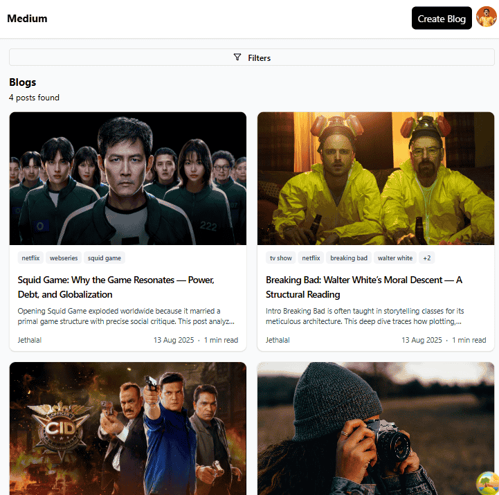
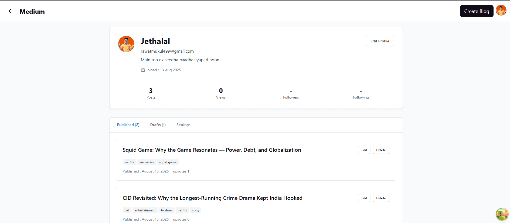
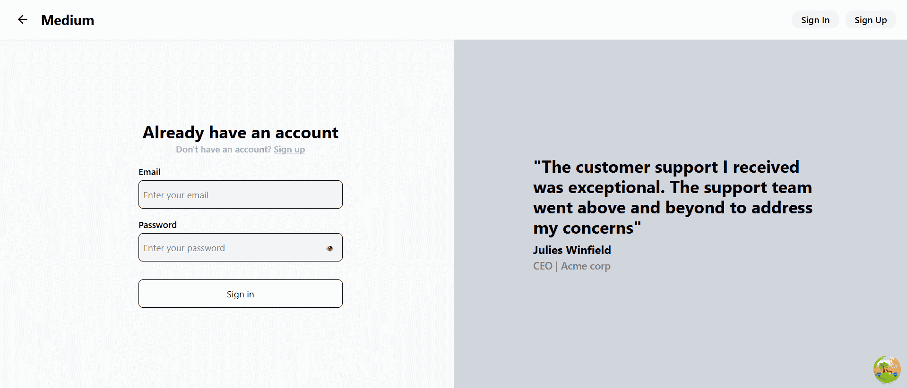
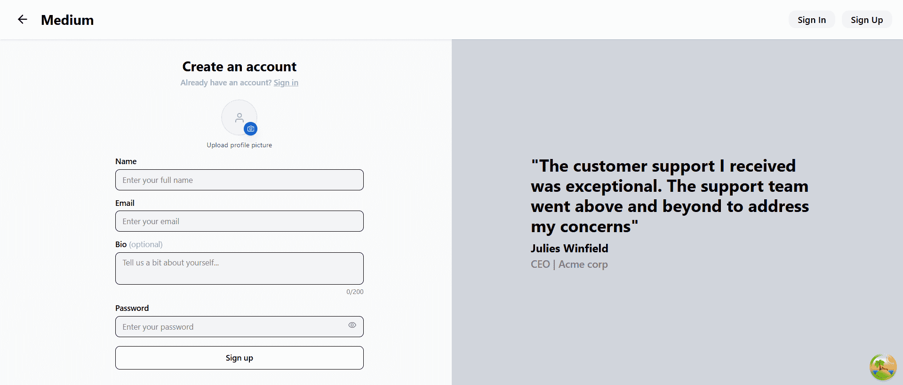

📝 Blogging App
A modern, full-stack blogging platform built for creators, readers, and storytellers. Share your thoughts, inspire others, and manage your content with ease.

✨ Features
🖊 Create, Edit & Publish blogs with a rich text editor

🖼 Image Uploads to make your posts more engaging

🔍 Search & Filter blogs by title, tags, or category

📱 Responsive Design – works seamlessly on mobile and desktop

💬 Comments System to interact with your readers

🔒 Secure Authentication with JWT & HttpOnly cookies

⚡ Real-time Updates powered by React Query and modern APIs

🛠 Tech Stack
Frontend: React + TypeScript + Tailwind CSS
Backend: Hono + PostgreSQL
Authentication: JWT + HttpOnly Cookies
Deployment: Vercel / Cloudflare Workers

📸 Screenshots

  
 
  
 
  
 
  
 
  
